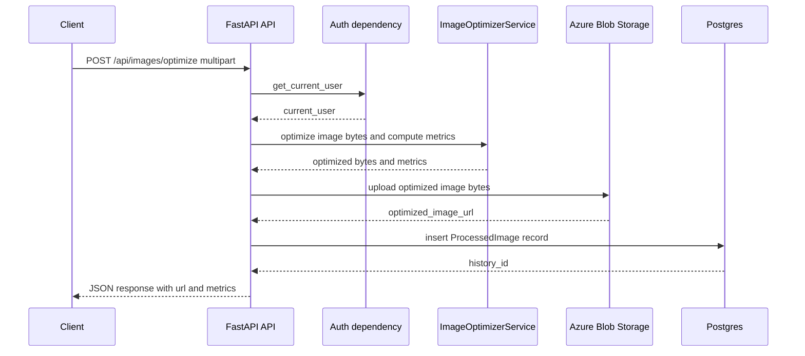

# Meesho Image Optimizer: Backend Engine + API Architecture Blueprint

## Purpose

Design the backend image-optimization engine and API endpoints for Meesho seller images, including:
- deterministic, testable image pipeline
- cost prediction using actual vs volumetric weight
- persistence for history and metrics
- FastAPI integration consistent with existing auth + DB patterns

This doc is architecture/design only and is derived from the repo’s current state and the provided research summary.

---

## Repo research facts (ground truth citations)

- FastAPI currently includes routers with manual imports; only `auth` router is registered and is mounted at `/api` (no `/api/v1`) in [`backend/app/main.py`](backend/app/main.py:60).
- Authentication uses dependency-based JWT Bearer tokens, with `get_current_user()` in [`backend/app/middlewares/auth.py`](backend/app/middlewares/auth.py:31), used as `Depends(get_current_user)` in routes.
- Database sessions use an async SQLAlchemy dependency `get_db()` imported in [`backend/app/main.py`](backend/app/main.py:15) and used in endpoints like [`backend/app/main.py`](backend/app/main.py:70).
- A history model exists: `ProcessedImage` in [`backend/app/models/image.py`](backend/app/models/image.py:6), but it lacks detailed metrics fields needed (sizes, dimensions, costs).
- Image processing dependencies (OpenCV, Pillow, NumPy) are not present in [`backend/requirements.txt`](backend/requirements.txt:1).
- API docs claim `/api/v1` as the base URL in [`docs/API.md`](docs/API.md:10), but the app currently mounts routers at `/api` in [`backend/app/main.py`](backend/app/main.py:60).

---

## Key design decisions (confirmed)

1. **Base API prefix**: use `/api` to match current router mount in [`backend/app/main.py`](backend/app/main.py:60) and avoid a breaking change.
2. **Optimized image bytes transport**: return JSON that includes an **Azure Blob URL** to the optimized image, plus metrics and cost details. Raw bytes are not returned in JSON.

---

## A) API design

### A1. Router module and registration

- New router module: [`backend/app/routers/images.py`](backend/app/routers/images.py:1)
- Router registration in FastAPI: update [`backend/app/main.py`](backend/app/main.py:1) to include the new images router with prefix `/api`, consistent with current `auth` router inclusion at [`backend/app/main.py`](backend/app/main.py:60).

**Auth pattern**: All protected endpoints should require `current_user: User = Depends(get_current_user)` using [`backend/app/middlewares/auth.py`](backend/app/middlewares/auth.py:31). This keeps auth behavior consistent with the rest of the app.

**DB pattern**: Endpoints needing persistence use `db: AsyncSession = Depends(get_db)` consistent with [`backend/app/main.py`](backend/app/main.py:70).

### A2. Endpoints and exact paths (canonical)

#### POST `/api/images/optimize`

**Purpose**: Optimize a single product image via the new engine and persist an optimization history record for the authenticated user.

**Auth**: Required (Bearer token). Implement via `Depends(get_current_user)` from [`backend/app/middlewares/auth.py`](backend/app/middlewares/auth.py:31).

**Request**: `multipart/form-data`

- `image` (file, required): image bytes. Accept at least JPEG and PNG.
- `weight_g` (int, required): actual weight in grams.
- `weight_category` (string, optional): a bracket string (example `0-200g`). Stored for UI/audit. If supplied without `weight_g`, the server should reject with validation error (recommended) or derive a deterministic weight as described below (fallback option).
- `product_category` (string, required): category key used for heuristics (volumetric depth and assumed max dimension).

**Validation and constraints**
- Max input size: define and enforce, e.g. 10 MB (prevents memory exhaustion).
- Allowed content types: `image/jpeg`, `image/png`, optionally `image/webp`.

**Response (200)**: JSON object.

Proposed response shape (close to required output, but includes URL for bytes):

```json
{
  "optimized_image_url": "https://.../optimized/uuid.jpg",
  "savings": 12.34,
  "current_cost": 45.0,
  "optimized_cost": 40.0,
  "metrics": {
    "original_size_kb": 512.5,
    "optimized_size_kb": 243.8,
    "original_resolution": "4000x3000",
    "optimized_resolution": "1200x1200",
    "original_format": "jpeg",
    "optimized_format": "jpeg",
    "processing_time_ms": 1234,
    "quality_final": 82
  },
  "weights": {
    "actual_weight_g": 180,
    "volumetric_weight_g": 220,
    "billable_weight_g": 220,
    "assumed_dimensions_cm": "28x22x2"
  },
  "history_id": "uuid",
  "engine_version": "image-optimizer-v1",
  "warnings": []
}
```

Notes:
- The required engine output includes `optimized_image_bytes`. At the API boundary, this is replaced with `optimized_image_url` to Azure Blob.
- `warnings` is a list of non-fatal issues (example: product detection fallback used).

**Error responses**
- `401` if no/invalid token (consistent with [`backend/app/middlewares/auth.py`](backend/app/middlewares/auth.py:50)).
- `413` for input too large.
- `415` for unsupported media type.
- `422` for invalid form fields.
- `500` for unexpected failures (should include request id / correlation id for debugging).

**Fallback option for `weight_category` without `weight_g`**
If product UX only provides a bracket, define a deterministic mapping:
- parse `a-b g` and choose `b` (upper bound) as conservative `weight_g` so costs are not under-estimated.
This must be explicitly documented and tested. Recommended approach remains requiring `weight_g` explicitly.

#### GET `/api/images/history`

**Purpose**: Return the authenticated user’s recent optimization history.

**Auth**: Required, same dependency.

**Query parameters**
- `limit` (int, default 20, max 100)
- `cursor` (optional): opaque cursor for pagination (recommended) or `page` (offset pagination). Cursor is preferred for stable ordering.

**Response (200)**:
```json
{
  "items": [
    {
      "id": "uuid",
      "created_at": "2026-01-09T00:00:00Z",
      "original_filename": "x.jpg",
      "original_resolution": "4000x3000",
      "optimized_resolution": "1200x1200",
      "original_size_kb": 512.5,
      "optimized_size_kb": 243.8,
      "optimized_image_url": "https://.../uuid.jpg",
      "actual_weight_g": 180,
      "volumetric_weight_g": 220,
      "billable_weight_g": 220,
      "current_cost": 45.0,
      "optimized_cost": 40.0,
      "savings": 12.34,
      "weight_category": "0-200g",
      "product_category": "apparel",
      "engine_version": "image-optimizer-v1",
      "warnings": []
    }
  ],
  "next_cursor": "opaque-string-or-null"
}
```

**Consistency note**: The current API docs reference `/api/v1` in [`docs/API.md`](docs/API.md:10). This design keeps `/api` canonical to match the live app mount in [`backend/app/main.py`](backend/app/main.py:60). A doc update will be needed later to avoid confusion.

### A3. API flow overview (Mermaid)



---

## B) Persistence and history strategy

### B1. Model choice

**Recommended**: extend existing `ProcessedImage` model in [`backend/app/models/image.py`](backend/app/models/image.py:6) with additional columns, and create an Alembic migration.

Rationale:
- A table already exists and is aligned to “processed images” history.
- Extending avoids fragmentation across multiple history tables.
- Alembic is already present in the repo (`backend/alembic/`) and used for initial migration.

Alternative (not chosen): create a new table for detailed metrics, linked to `processed_images` by FK. This can be revisited if `ProcessedImage` starts to mix too many concerns.

### B2. Proposed schema additions

Current fields (existing): `id`, `user_id`, `original_filename`, `azure_blob_url`, `weight_category`, `savings_amount`, `is_trial`, `created_at` in [`backend/app/models/image.py`](backend/app/models/image.py:6).

Add these columns (proposed):

**Image input/output**
- `original_content_type` (string, nullable)
- `optimized_content_type` (string, default `image/jpeg`)
- `original_size_bytes` (int)
- `optimized_size_bytes` (int)
- `original_width_px` (int)
- `original_height_px` (int)
- `optimized_width_px` (int, default 1200)
- `optimized_height_px` (int, default 1200)

**Weights and dimensions**
- `actual_weight_g` (int)
- `volumetric_weight_g` (int)
- `billable_weight_g` (int)
- `assumed_dim_w_cm` (float)
- `assumed_dim_h_cm` (float)
- `assumed_dim_d_cm` (float)

**Costs**
- `current_cost` (float)
- `optimized_cost` (float)
- `savings_percent` (float)
- keep `savings_amount` (float) as absolute currency delta (already exists as `savings_amount`)

**Processing metadata**
- `engine_version` (string) (example `image-optimizer-v1`)
- `processing_time_ms` (int)
- `quality_final` (int)
- `status` (string) (example `success`, `failed`)
- `error_code` (string, nullable)
- `warnings_json` (JSON/text, nullable) (for deterministic warnings list)
- Optional: `debug_json` (JSON/text, nullable) guarded by env flag for diagnostics

**Storage**
- reuse `azure_blob_url` for optimized output.
- do not store optimized bytes in DB (avoids DB bloat, aligns with Blob usage already present in model as `azure_blob_url` in [`backend/app/models/image.py`](backend/app/models/image.py:12)).

### B3. Migration and backfill notes

- Migration should set safe defaults where possible:
  - `optimized_width_px=1200`, `optimized_height_px=1200`
  - `optimized_content_type=image/jpeg`
  - `engine_version=image-optimizer-v1`
- Existing rows may have nulls for newly added metrics. History endpoint must handle null-safe serialization.

---

## C) Image engine design (service layer)

### C1. Service contract

New service module: [`backend/app/services/image_optimizer.py`](backend/app/services/image_optimizer.py:1)

**Input**
- `image_bytes: bytes`
- `weight_g: int`
- `category: str` (maps from `product_category` form field)

**Output (engine internal)**
The engine returns bytes + calculated metrics:

```json
{
  "optimized_image_bytes": "bytes",
  "savings": 0.0,
  "current_cost": 0.0,
  "optimized_cost": 0.0,
  "metrics": {
    "original_size_kb": 0.0,
    "optimized_size_kb": 0.0,
    "original_resolution": "WxH",
    "optimized_resolution": "1200x1200"
  }
}
```

At the API boundary, `optimized_image_bytes` are uploaded and replaced with URL.

### C2. Pipeline stages (deterministic order)

Stages and their design goals:

1. **Decode and normalize**
   - Decode bytes into RGB image.
   - Convert to NumPy array.
   - Normalize orientation if EXIF present (Pillow can auto-orient); then strip metadata in output.

2. **SMART CROP** (product fills ~75% frame)
   - Goal: detect product foreground and crop a bounding box such that product occupies 75% of the resulting crop area (by area ratio), within tolerance.

3. **RESIZE** (maintain aspect)
   - Resize product image to fit within 1200x1200 while maintaining aspect ratio.

4. **SQUARE** (pad to 1:1)
   - Place resized image on a 1200x1200 white canvas, centered.

5. **BACKGROUND** (ensure white if possible)
   - Use a foreground mask; set pixels outside product to white.
   - If no mask, perform corner sampling heuristic to whiten background if corners are near-white already.

6. **SHARPEN** (unsharp mask)
   - Apply unsharp mask with fixed parameters for deterministic behavior.

7. **COMPRESS** (<250 KB at target quality)
   - JPEG encode at quality 85; if >250 KB, decrease quality stepwise (deterministic) until threshold or a floor quality is hit.

**Note**: Some stages may share intermediate outputs (mask and bounding box).

### C3. SMART CROP algorithm (OpenCV primitives)

**Primary approach** (robust for synthetic tests and many real images):
1. Convert RGB to grayscale and HSV.
2. Compute edges using Canny.
3. Morphological close (dilate then erode) to connect edges.
4. Find contours.
5. Choose the largest contour by area that is not near-full-frame.
6. Compute bounding rect for that contour.
7. Expand bounding box by a margin factor to hit target area occupancy.
   - Let bounding box area be $A_p$ and crop area be $A_c$.
   - Aim for $A_p / A_c \approx 0.75$.
   - Choose crop area $A_c = A_p / 0.75$.
   - Derive crop width and height by expanding bounding box uniformly while clamping to image boundaries.

**Fallback**:
- If no contours found (or contour area too small), skip crop and use full image.
- Record warning: `product_detection_failed`.

**Determinism**:
- Use fixed thresholds for Canny and fixed morph kernel sizes.
- Avoid ML-based segmentation to keep tests stable.

### C4. BACKGROUND whitening algorithm

**Preferred**: whiten background using foreground mask from crop stage.
- Use a binary mask from contour fill or GrabCut:
  - Create mask by filling selected contour.
  - Optionally refine with erosion/dilation to remove noise.
- Set pixels where mask is 0 to white (255,255,255).
- Feather boundary (optional) using a small Gaussian blur on mask edge to avoid halos; keep deterministic kernel.

**Fallback**:
- If no mask, sample corners to infer whether background is already white:
  - sample 5x5 patches in all 4 corners; compute mean brightness.
  - if all corners exceed a threshold (example mean > 245), treat background as white and apply gentle normalization.
  - else do nothing and record warning `background_not_whitened`.

### C5. RESIZE + SQUARE design

- Compute scale factor so the longer side becomes 1200.
- Resize with an interpolation method appropriate for downscale (OpenCV `INTER_AREA`).
- Create 1200x1200 white canvas and center the resized image.
- Final output resolution is always `1200x1200`, matching required output shape.

### C6. SHARPEN (unsharp mask)

Deterministic unsharp mask:
- blur = Gaussian(image, sigma fixed)
- sharpened = image * (1 + amount) + blur * (-amount)
- clamp to [0..255]

Recommended parameters (to tune later but keep fixed for tests):
- sigma = 1.0
- amount = 0.6
- thresholding off (always apply)

### C7. COMPRESS (<250 KB)

JPEG encoding should be deterministic and bounded:
- Start at quality 85.
- Encode; if output size > 250 KB, decrement quality by fixed steps (example -5) down to minimum quality 60.
- If still too large at min quality, keep min quality output and record warning `size_target_not_met`.

Encoding library:
- Pillow JPEG encoder (stable, widely used).
- Always output JPEG to standardize pipeline unless input is transparent PNG (then flatten onto white and still output JPEG).

### C8. Cost prediction design

Goal: compute costs for shipping before and after optimization based on billable weight.

**Definitions**
- $actual\_weight\_g$ = input `weight_g`.
- $volumetric\_g$ computed from assumed dimensions:
  - $volumetric\_kg = (W\_{cm} \cdot H\_{cm} \cdot D\_{cm}) / 5000$
  - $volumetric\_g = 1000 \cdot volumetric\_kg$
- $billable\_g = max(actual\_weight\_g, volumetric\_g)$

**Cost lookup**
- Costs should be driven by a deterministic mapping in config:
  - Example slabs: 0-200g, 200-500g, 500-1000g, 1000-1500g, 1500-2000g, 2000g+
- `current_cost` uses billable weight computed from original assumed dimensions.
- `optimized_cost` uses billable weight computed from optimized assumed dimensions.
  - Since output is standardized to 1200x1200, dimensions may change based on crop and category assumptions; see next section.

**Important constraint**: The repo does not define actual cost slabs in the cited files; the implementation must introduce a source of truth (config or DB). The architecture assumes a config-based mapping to make tests deterministic.

### C9. Deterministic heuristic for W/H/D cm from image analysis

This is inherently under-determined from a single image. For testability, adopt explicit assumptions:

**Assumption set**
1. The image is a top-down or front-facing view with no reliable depth cues.
2. We infer physical size by mapping pixel bounding box dimensions to a category-specific maximum dimension.
3. Depth `D_cm` is category-based constant.

**Heuristic (deterministic)**
- From SMART CROP, get the product bounding box in pixels: `bbox_w_px`, `bbox_h_px`.
- Let `bbox_long_px = max(bbox_w_px, bbox_h_px)`.

Define category configuration (examples):
- apparel: `max_dim_cm=35`, `depth_cm=2`
- footwear: `max_dim_cm=32`, `depth_cm=12`
- electronics: `max_dim_cm=25`, `depth_cm=6`
- home: `max_dim_cm=40`, `depth_cm=15`
- default: `max_dim_cm=30`, `depth_cm=5`

Compute scale:
- `px_per_cm = bbox_long_px / max_dim_cm`
- `W_cm = bbox_w_px / px_per_cm`
- `H_cm = bbox_h_px / px_per_cm`
- `D_cm = depth_cm`

Clamp and round:
- clamp W,H to [1..max_dim_cm]
- round to 1 decimal place for storage and stable tests

**Optimized dimensions**
- Since the algorithm crops tightly and pads, the product bbox in the optimized image can be estimated as a fixed ratio:
  - target product fill is 75% of frame area; for a square frame:
    - product side ratio approx $\sqrt{0.75} \approx 0.866$
  - thus `optimized_bbox_long_px ≈ 0.866 * 1200 ≈ 1039` (rounded deterministically)
- Use the same category mapping to compute W/H, keeping D the same.

This provides deterministic results for both original and optimized volumetric weights in tests.

### C10. Failure modes and handling

- **Unreadable image bytes**: return `400/415` from API with structured error.
- **No product detected**: skip crop and mask; proceed with resize/pad/compress; add warning.
- **Very small images**: upscale to 1200 while minimizing artifacts; add warning `upscaled_input`.
- **Huge images**: downscale early to a working max (example 4096px max side) to control CPU and memory; add warning `pre_downscaled`.
- **Cannot meet 250 KB target**: return best effort output; warning `size_target_not_met`.

All warnings should be persisted to history for explainability.

---

## D) Dependency and packaging plan

### D1. Python package dependencies (to add)

Add to [`backend/requirements.txt`](backend/requirements.txt:1):

- `pillow` (image IO and JPEG encoding)
- `numpy` (pixel arrays)
- `opencv-python-headless` (OpenCV primitives without GUI dependencies)

Optional (only if needed later):
- `python-magic` for file-type sniffing (content-type validation)

### D2. OS-level and container concerns

- Prefer `opencv-python-headless` to avoid GUI libs (libGL) issues in minimal Docker images.
- Ensure Docker base image includes required system packages for Pillow (usually handled by wheels; otherwise add build deps in Dockerfile if compilation occurs).

### D3. Async-friendliness / performance

Image optimization is CPU-bound. Keep FastAPI endpoints async but offload CPU work:
- Use a threadpool executor (Starlette/AnyIO) for the optimization function.
- Bound concurrency to prevent CPU starvation:
  - add a semaphore or use a worker pool size based on CPU cores.
- Enforce input size limits early before decoding to prevent memory blowups.

---

## E) Testing strategy (service + API)

### E1. No copyrighted external images

Use synthetic images generated during tests:
- Create blank white backgrounds with Pillow/NumPy.
- Draw a solid colored rectangle (product) centered or offset.
- Optionally add noise / gradients to test robustness.
- Save to bytes as JPEG/PNG in-memory.

This yields deterministic fixtures without external assets.

### E2. Deterministic validations (what to assert)

**Service unit tests** for [`backend/app/services/image_optimizer.py`](backend/app/services/image_optimizer.py:1):
- output resolution exactly `1200x1200`
- output format is JPEG bytes (validate magic header `FF D8` in implementation)
- size in KB is `< 250` when feasible; otherwise warning present
- background is white by sampling corner pixels and asserting channel values above threshold
- crop behavior: product occupancy close to 75% (within tolerance) by recomputing product bbox in synthetic images

**Cost tests**
- given known category mapping and synthetic bbox sizes, verify computed W/H/D, volumetric_g, billable_g and slab selection are exact.
- verify savings and costs:
  - `savings = current_cost - optimized_cost`
  - `savings_percent = savings / current_cost * 100` if `current_cost > 0`

**API tests** for new router [`backend/app/routers/images.py`](backend/app/routers/images.py:1):
- auth required: missing token yields `401` consistent with [`backend/app/middlewares/auth.py`](backend/app/middlewares/auth.py:50)
- happy path: returns JSON with url and metrics (mock blob upload)
- history endpoint returns recent items (seed DB)

### E3. Coverage approach

Requirement target: 100% coverage for [`backend/tests/test_image_optimizer.py`](backend/tests/test_image_optimizer.py:1).

Recommended test decomposition:
- Pure functions: bbox detection, area targeting, dimension heuristic, slab lookup
- Integration tests: end-to-end pipeline
- API tests: httpx TestClient/AsyncClient with dependency overrides

To keep tests deterministic and fast:
- Stub Azure Blob upload: replace with a fake uploader returning a fixed URL.
- Use a test database transaction per test or SQLite async alternative if compatible with current setup.

---

## Implementation handoff (what Code mode will build)

Files to create or modify (no code here, just the target list):
- create [`backend/app/services/image_optimizer.py`](backend/app/services/image_optimizer.py:1)
- create [`backend/app/routers/images.py`](backend/app/routers/images.py:1)
- modify router registration in [`backend/app/main.py`](backend/app/main.py:1)
- extend model + create Alembic migration based on [`backend/app/models/image.py`](backend/app/models/image.py:6)
- update [`backend/requirements.txt`](backend/requirements.txt:1)
- create [`backend/tests/test_image_optimizer.py`](backend/tests/test_image_optimizer.py:1)
- update docs mismatch in [`docs/API.md`](docs/API.md:10) (align to `/api`)

---

## Open risks and mitigations

1. **Volumetric dimensions from a single image are an approximation**  
   Mitigation: explicit category-driven heuristic with deterministic mapping and clear warnings in output.

2. **Meeting the 250 KB threshold may fail for complex images**  
   Mitigation: bounded quality reduction, accept best effort with warning, and track actual size.

3. **CPU-bound processing may degrade API latency under load**  
   Mitigation: threadpool offload and concurrency limits; consider background jobs later if needed.

4. **Docs/API base URL mismatch** between `/api/v1` docs and `/api` app mount  
   Mitigation: update docs to `/api` or implement a versioned mount in a future breaking-change release.