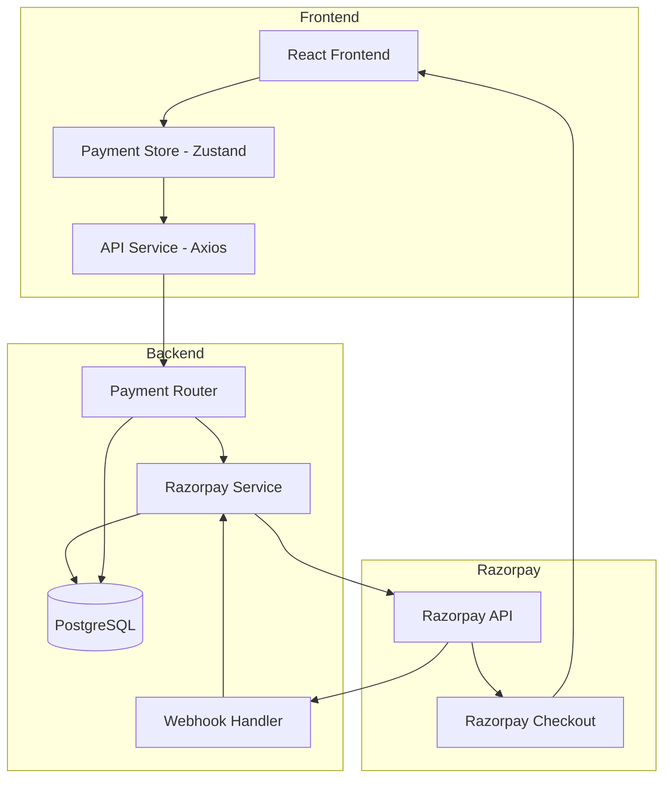
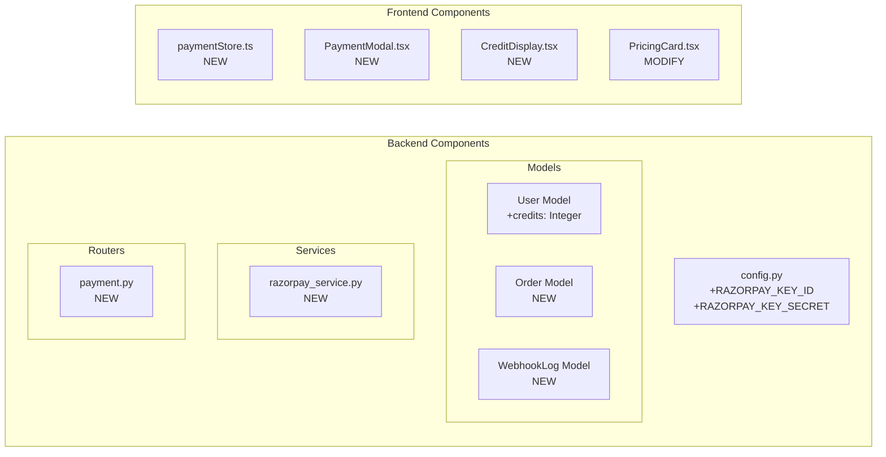
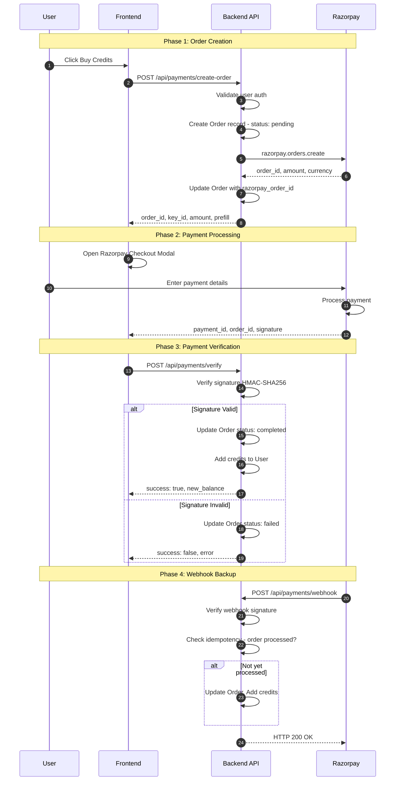
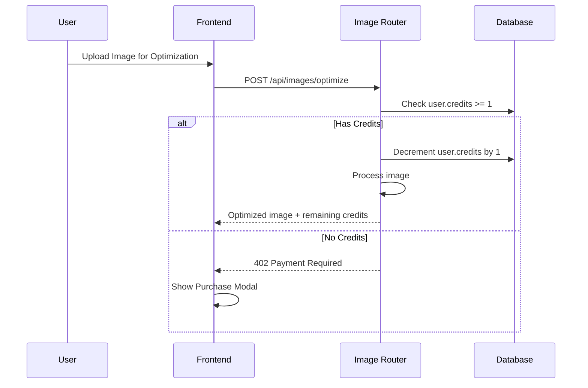
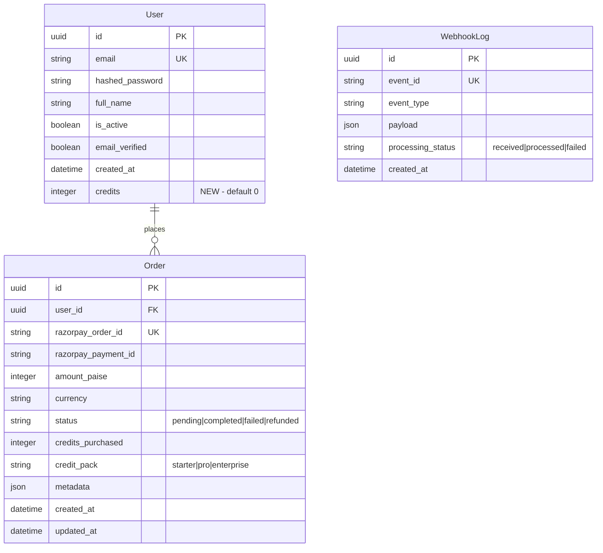

# Razorpay Payment Integration Architecture

**Created:** 2026-01-14 15:35:00 IST
**Status:** Draft - Ready for Review
**Target Mode:** Code
**Estimated Implementation Steps:** 12

---

## Table of Contents
1. [Overview](#overview)
2. [System Architecture](#system-architecture)
3. [Data Flow](#data-flow)
4. [Database Schema](#database-schema)
5. [API Specifications](#api-specifications)
6. [Implementation Plan](#implementation-plan)
7. [Security Considerations](#security-considerations)
8. [Error Handling Strategy](#error-handling-strategy)
9. [Design Decisions](#design-decisions)

---

## Overview

### Purpose
Implement Razorpay one-time payment integration for purchasing image processing credits in the Meesho Image Optimizer application.

### Key Requirements
- **Payment Type**: One-time credit purchases (NOT subscriptions)
- **Currency**: INR only
- **Credit Packs**: 
  - Starter: ₹99 for 50 images
  - Pro: ₹199 for 120 images
  - Enterprise: ₹499 for 350 images
- **Security**: Server-side signature verification, webhook handling
- **Idempotency**: Handle duplicate webhooks gracefully

### Success Criteria
- Users can purchase credits via Razorpay checkout
- Credits are allocated only after verified payment
- Webhook handles payment.captured events idempotently
- Payment history is tracked in database

---

## System Architecture

### High-Level Architecture Diagram



### Component Architecture



---

## Data Flow

### Payment Lifecycle Flow



### Credit Deduction Flow (Existing System Integration)



---

## Database Schema

### Entity Relationship Diagram



### Schema Details

#### User Model Changes

**File:** [`backend/app/models/user.py`](../backend/app/models/user.py)

```python
# Add to existing User model
credits = Column(Integer, default=0, nullable=False)
```

#### New Order Model

**File:** `backend/app/models/order.py` (NEW)

```python
from sqlalchemy import Column, String, Integer, DateTime, ForeignKey, JSON, func
from sqlalchemy.dialects.postgresql import UUID
from sqlalchemy.orm import relationship
import uuid
from app.models.user import Base

class Order(Base):
    __tablename__ = "orders"
    
    id = Column(UUID(as_uuid=True), primary_key=True, default=uuid.uuid4)
    user_id = Column(UUID(as_uuid=True), ForeignKey("users.id"), nullable=False)
    
    # Razorpay identifiers
    razorpay_order_id = Column(String, unique=True, index=True, nullable=False)
    razorpay_payment_id = Column(String, unique=True, nullable=True)
    razorpay_signature = Column(String, nullable=True)
    
    # Payment details
    amount_paise = Column(Integer, nullable=False)  # Store in paise (₹99 = 9900)
    currency = Column(String(3), default="INR", nullable=False)
    
    # Order status
    status = Column(String(20), default="pending", nullable=False)
    # Values: pending, completed, failed, refunded
    
    # Credit pack info
    credits_purchased = Column(Integer, nullable=False)
    credit_pack = Column(String(20), nullable=False)  # starter, pro, enterprise
    
    # Metadata for debugging
    metadata = Column(JSON, nullable=True)
    
    # Timestamps
    created_at = Column(DateTime(timezone=True), server_default=func.now())
    updated_at = Column(DateTime(timezone=True), onupdate=func.now())
    
    # Relationship
    user = relationship("User", back_populates="orders")
```

#### New WebhookLog Model

**File:** `backend/app/models/webhook_log.py` (NEW)

```python
from sqlalchemy import Column, String, DateTime, JSON, func
from sqlalchemy.dialects.postgresql import UUID
import uuid
from app.models.user import Base

class WebhookLog(Base):
    __tablename__ = "webhook_logs"
    
    id = Column(UUID(as_uuid=True), primary_key=True, default=uuid.uuid4)
    event_id = Column(String, unique=True, index=True, nullable=False)
    event_type = Column(String(50), nullable=False)
    payload = Column(JSON, nullable=False)
    processing_status = Column(String(20), default="received", nullable=False)
    # Values: received, processed, failed
    error_message = Column(String, nullable=True)
    created_at = Column(DateTime(timezone=True), server_default=func.now())
```

### Credit Pack Configuration

```python
# backend/app/config.py or separate constants file

CREDIT_PACKS = {
    "starter": {
        "name": "Starter Pack",
        "credits": 50,
        "price_inr": 99,
        "price_paise": 9900,
        "per_image_cost": 1.98,
    },
    "pro": {
        "name": "Pro Pack",
        "credits": 120,
        "price_inr": 199,
        "price_paise": 19900,
        "per_image_cost": 1.66,
    },
    "enterprise": {
        "name": "Enterprise Pack",
        "credits": 350,
        "price_inr": 499,
        "price_paise": 49900,
        "per_image_cost": 1.43,
    },
}
```

---

## API Specifications

### Base Path: `/api/payments`

### Endpoints

#### 1. Create Order

**POST** `/api/payments/create-order`

Creates a Razorpay order for credit purchase.

**Request:**
```json
{
  "pack_id": "starter" | "pro" | "enterprise"
}
```

**Response (200 OK):**
```json
{
  "order_id": "order_ABC123xyz",
  "amount": 9900,
  "currency": "INR",
  "key_id": "rzp_test_xxx",
  "prefill": {
    "email": "user@example.com",
    "name": "User Name"
  },
  "notes": {
    "pack_id": "starter",
    "credits": 50,
    "user_id": "uuid-xxx"
  }
}
```

**Error Responses:**
- `400 Bad Request`: Invalid pack_id
- `401 Unauthorized`: Not authenticated
- `500 Internal Server Error`: Razorpay API failure

---

#### 2. Verify Payment

**POST** `/api/payments/verify`

Verifies payment signature and allocates credits.

**Request:**
```json
{
  "razorpay_order_id": "order_ABC123xyz",
  "razorpay_payment_id": "pay_XYZ789abc",
  "razorpay_signature": "hmac-sha256-signature"
}
```

**Response (200 OK):**
```json
{
  "success": true,
  "message": "Payment verified successfully",
  "credits_added": 50,
  "new_balance": 55,
  "order_id": "uuid-internal-order"
}
```

**Error Responses:**
- `400 Bad Request`: Signature verification failed
- `404 Not Found`: Order not found
- `409 Conflict`: Order already processed

---

#### 3. Razorpay Webhook

**POST** `/api/payments/webhook`

Handles Razorpay webhook events (no auth required, signature verified).

**Headers:**
```
X-Razorpay-Signature: webhook-signature
```

**Request Body:** (Razorpay webhook payload)

**Response:**
- `200 OK`: Webhook processed
- `400 Bad Request`: Invalid signature

---

#### 4. Get Credit Balance

**GET** `/api/payments/balance`

Returns current user credit balance.

**Response (200 OK):**
```json
{
  "credits": 55,
  "user_id": "uuid-xxx"
}
```

---

#### 5. Get Order History

**GET** `/api/payments/orders`

Returns user's payment history.

**Query Parameters:**
- `limit`: Number of orders (default: 10, max: 50)
- `offset`: Pagination offset

**Response (200 OK):**
```json
{
  "orders": [
    {
      "id": "uuid-order",
      "pack_name": "Starter Pack",
      "credits": 50,
      "amount_inr": 99,
      "status": "completed",
      "created_at": "2026-01-14T10:00:00Z"
    }
  ],
  "total": 5,
  "limit": 10,
  "offset": 0
}
```

---

## Implementation Plan

### File Structure

```
backend/
├── app/
│   ├── config.py                    # MODIFY: Add Razorpay settings
│   ├── models/
│   │   ├── __init__.py              # MODIFY: Export new models
│   │   ├── user.py                  # MODIFY: Add credits column
│   │   ├── order.py                 # NEW
│   │   └── webhook_log.py           # NEW
│   ├── routers/
│   │   ├── __init__.py              # MODIFY: Export payment router
│   │   └── payment.py               # NEW
│   ├── services/
│   │   └── razorpay_service.py      # NEW
│   ├── schemas/
│   │   └── payment.py               # NEW
│   └── main.py                      # MODIFY: Register payment router
├── alembic/
│   └── versions/
│       └── 2026XXXX_add_credits_and_orders.py  # NEW

frontend/
├── src/
│   ├── stores/
│   │   └── paymentStore.ts          # NEW
│   ├── components/
│   │   ├── PaymentModal.tsx         # NEW
│   │   ├── CreditBalance.tsx        # NEW
│   │   └── PricingCard.tsx          # MODIFY: Add buy button
│   ├── services/
│   │   └── api.ts                   # MODIFY: Add payment endpoints
│   └── types/
│       └── index.ts                 # MODIFY: Add payment types
```

### Step-by-Step Implementation

#### Phase 1: Backend Infrastructure

**Step 1: Update Config**
- **File:** `backend/app/config.py`
- **Tool:** `apply_diff`
- Add `RAZORPAY_KEY_ID` and `RAZORPAY_KEY_SECRET` to Settings class
- Add `RAZORPAY_WEBHOOK_SECRET` for webhook verification

**Step 2: Add Credits to User Model**
- **File:** `backend/app/models/user.py`
- **Tool:** `apply_diff`
- Add `credits = Column(Integer, default=0, nullable=False)`
- Add relationship to orders

**Step 3: Create Order Model**
- **File:** `backend/app/models/order.py`
- **Tool:** `write_to_file`
- Create new Order model as specified

**Step 4: Create WebhookLog Model**
- **File:** `backend/app/models/webhook_log.py`
- **Tool:** `write_to_file`
- Create new WebhookLog model as specified

**Step 5: Update Models Init**
- **File:** `backend/app/models/__init__.py`
- **Tool:** `apply_diff`
- Export Order and WebhookLog

**Step 6: Create Alembic Migration**
- **Tool:** `execute_command`
- Command: `cd backend && alembic revision --autogenerate -m "add_credits_orders_webhooks"`
- Verify migration file
- Run: `alembic upgrade head`

#### Phase 2: Backend Services and Routes

**Step 7: Create Payment Schemas**
- **File:** `backend/app/schemas/payment.py`
- **Tool:** `write_to_file`
- Define Pydantic models for request/response

**Step 8: Create Razorpay Service**
- **File:** `backend/app/services/razorpay_service.py`
- **Tool:** `write_to_file`
- Implement `create_order()`, `verify_signature()`, `verify_webhook_signature()`

**Step 9: Create Payment Router**
- **File:** `backend/app/routers/payment.py`
- **Tool:** `write_to_file`
- Implement all endpoints as specified

**Step 10: Register Payment Router**
- **File:** `backend/app/main.py`
- **Tool:** `apply_diff`
- Import and include payment router

#### Phase 3: Frontend Integration

**Step 11: Add Payment Types**
- **File:** `frontend/src/types/index.ts`
- **Tool:** `apply_diff`
- Add payment-related type definitions

**Step 12: Update API Service**
- **File:** `frontend/src/services/api.ts`
- **Tool:** `apply_diff`
- Add payment API functions

**Step 13: Create Payment Store**
- **File:** `frontend/src/stores/paymentStore.ts`
- **Tool:** `write_to_file`
- Zustand store for payment state

**Step 14: Create Payment Modal**
- **File:** `frontend/src/components/PaymentModal.tsx`
- **Tool:** `write_to_file`
- Razorpay checkout integration component

**Step 15: Create Credit Balance Component**
- **File:** `frontend/src/components/CreditBalance.tsx`
- **Tool:** `write_to_file`
- Display current credits

**Step 16: Update PricingCard**
- **File:** `frontend/src/components/PricingCard.tsx`
- **Tool:** `apply_diff`
- Add "Buy Now" functionality

#### Phase 4: Testing & Verification

**Step 17: Manual Testing**
- Test with Razorpay test mode
- Verify order creation
- Verify payment flow
- Verify webhook handling
- Verify credit allocation

---

## Security Considerations

### Authentication & Authorization

1. **All payment endpoints require authentication** except webhook
2. **Webhook signature verification** using HMAC-SHA256
3. **Server-side signature verification** for payment confirmation

### Signature Verification

```python
# Payment verification (client-initiated)
def verify_payment_signature(order_id: str, payment_id: str, signature: str) -> bool:
    message = f"{order_id}|{payment_id}"
    expected = hmac.new(
        key=settings.RAZORPAY_KEY_SECRET.encode(),
        msg=message.encode(),
        digestmod=hashlib.sha256
    ).hexdigest()
    return hmac.compare_digest(signature, expected)

# Webhook verification
def verify_webhook_signature(body: bytes, signature: str) -> bool:
    expected = hmac.new(
        key=settings.RAZORPAY_WEBHOOK_SECRET.encode(),
        msg=body,
        digestmod=hashlib.sha256
    ).hexdigest()
    return hmac.compare_digest(signature, expected)
```

### Idempotency Strategy

1. **Order-level idempotency**: Check `Order.status` before processing
2. **Webhook deduplication**: Store `event_id` in WebhookLog
3. **Race condition handling**: Use database transactions with row-level locks

```python
# Idempotent webhook processing
async def process_payment_webhook(event_id: str, payload: dict, db: AsyncSession):
    # Check if already processed
    existing = await db.execute(
        select(WebhookLog).where(WebhookLog.event_id == event_id)
    )
    if existing.scalar_one_or_none():
        return  # Already processed, skip
    
    # Use transaction with lock
    async with db.begin():
        order = await db.execute(
            select(Order)
            .where(Order.razorpay_order_id == payload["order_id"])
            .with_for_update()  # Row-level lock
        )
        order = order.scalar_one_or_none()
        
        if order and order.status == "pending":
            order.status = "completed"
            # ... credit allocation
            
        # Log webhook
        db.add(WebhookLog(event_id=event_id, ...))
```

### Environment Variables

```env
# Required in .env
RAZORPAY_KEY_ID=rzp_test_xxxxx
RAZORPAY_KEY_SECRET=xxxxx
RAZORPAY_WEBHOOK_SECRET=xxxxx  # From Razorpay Dashboard > Webhooks
```

---

## Error Handling Strategy

### Backend Error Codes

| Error | HTTP Status | Description |
|-------|-------------|-------------|
| `INVALID_PACK` | 400 | Invalid pack_id provided |
| `ORDER_NOT_FOUND` | 404 | Razorpay order not found |
| `SIGNATURE_INVALID` | 400 | Payment signature verification failed |
| `ORDER_ALREADY_PROCESSED` | 409 | Order already completed/failed |
| `RAZORPAY_ERROR` | 502 | Razorpay API failure |
| `CREDITS_ALLOCATION_FAILED` | 500 | Failed to add credits |

### Error Response Format

```json
{
  "error": {
    "code": "SIGNATURE_INVALID",
    "message": "Payment signature verification failed",
    "details": null
  }
}
```

### Retry Strategy

- **Webhook failures**: Razorpay retries automatically
- **Client-side failures**: Frontend retries verification once
- **Database failures**: Transaction rollback, return error

---

## Design Decisions

### Decision 1: Credits on User vs Separate Wallet Table

**Chosen:** Credits column directly on User model

**Rationale:**
- Simpler implementation for MVP
- Single query to check/update credits
- User model is small, adding one column is efficient
- Can migrate to separate wallet table later if needed

**Trade-offs:**
- ✅ Simple, fast queries
- ✅ Atomic credit operations
- ❌ Less flexibility for complex wallet features
- ❌ No credit history on User level (use Order for history)

### Decision 2: Verify Payment - Frontend-Initiated vs Webhook-Only

**Chosen:** Both frontend verification AND webhook backup

**Rationale:**
- Frontend verification provides immediate user feedback
- Webhook handles edge cases (browser closed, network issues)
- Idempotency ensures no double-crediting

**Trade-offs:**
- ✅ Better UX with immediate confirmation
- ✅ Reliable with webhook backup
- ❌ Slightly more complex implementation
- ❌ Need idempotency handling

### Decision 3: Store Amount in Paise vs Rupees

**Chosen:** Paise (Integer)

**Rationale:**
- Matches Razorpay API format
- Avoids floating-point precision issues
- Industry standard for currency storage

### Decision 4: Separate WebhookLog Table

**Chosen:** Yes, dedicated table

**Rationale:**
- Enables idempotency checking
- Audit trail for debugging
- Can clean up old logs periodically

### Decision 5: Credit Pack Configuration

**Chosen:** Hardcoded constants (not database-driven)

**Rationale:**
- Simple for MVP
- Rarely changes
- Easy to update via deployment
- Can move to database later for admin panel

---

## Frontend Integration Notes

### Razorpay Checkout Script

Add to [`frontend/index.html`](../frontend/index.html):
```html
<script src="https://checkout.razorpay.com/v1/checkout.js"></script>
```

### Razorpay Checkout Options

```typescript
const options = {
  key: response.key_id,
  amount: response.amount,
  currency: response.currency,
  name: "Meesho Image Optimizer",
  description: `${pack.name} - ${pack.credits} Credits`,
  order_id: response.order_id,
  prefill: response.prefill,
  notes: response.notes,
  theme: { color: "#6366f1" },
  handler: async (response: RazorpayResponse) => {
    await verifyPayment(response);
  },
  modal: {
    ondismiss: () => { /* Handle modal close */ }
  }
};

const rzp = new window.Razorpay(options);
rzp.open();
```

### TypeScript Types for Razorpay

```typescript
// frontend/src/types/index.ts

interface RazorpayOptions {
  key: string;
  amount: number;
  currency: string;
  name: string;
  description: string;
  order_id: string;
  prefill: { email: string; name: string };
  notes: Record<string, string>;
  theme: { color: string };
  handler: (response: RazorpayResponse) => void;
}

interface RazorpayResponse {
  razorpay_order_id: string;
  razorpay_payment_id: string;
  razorpay_signature: string;
}

declare global {
  interface Window {
    Razorpay: new (options: RazorpayOptions) => { open: () => void };
  }
}
```

---

## Post-Implementation Verification

### Checklist

- [ ] Razorpay test mode order creation works
- [ ] Checkout modal opens with correct amount
- [ ] Payment succeeds in test mode
- [ ] Signature verification passes
- [ ] Credits added to user account
- [ ] Order status updated to "completed"
- [ ] Webhook endpoint responds 200 OK
- [ ] Duplicate webhooks don't double-credit
- [ ] Order history displays correctly
- [ ] Credit balance updates in UI

### Test Commands

```bash
# Backend tests
cd backend
python -m pytest tests/test_payments.py -v

# Check migration
alembic upgrade head
alembic current

# Manual API test
curl -X POST http://localhost:8000/api/payments/create-order \
  -H "Authorization: Bearer $TOKEN" \
  -H "Content-Type: application/json" \
  -d '{"pack_id": "starter"}'
```

---

## Update Log

- 2026-01-14 15:35:00 - Initial architecture document created

---

*This document is the reference architecture for implementing Razorpay payment integration. Proceed to Code mode for implementation.*